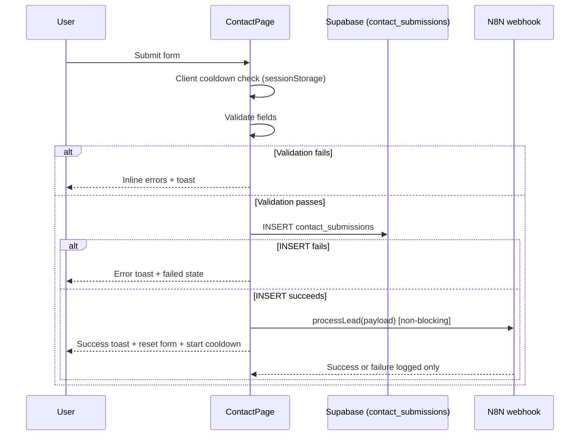

# Contact Form Architecture

Last updated: 2026-02-06 (repository snapshot)

## Purpose and Audience

This document is the source-of-truth technical reference for the `/contact` submission flow.

Audience:
- Frontend engineers maintaining the contact page UX.
- Backend/automation engineers maintaining Supabase and N8N integration.
- Maintainers investigating lead drop-offs and submission failures.

Out of scope:
- Implementing fixes in this document.
- Defining historical behavior from legacy docs.

## Current Entry Points

Primary route registration:
- `src/App.tsx:241` defines `path: 'contact'`.
- `src/App.tsx:242` mounts `ContactPage`.

Main navigation to `/contact`:
- `src/App.tsx:138` routes `ViewState.CONTACT` to `navigate('/contact')`.
- `src/components/LandingPage.tsx:50` uses `navigate('/contact')`.
- `src/components/Footer.tsx:32` has Support link `/contact`.

Related but inconsistent entry points:
- `src/components/Pricing.tsx:40` still tries `document.getElementById('contact')` after navigating home.
- `src/components/ServiceDetailPage.tsx:166` links to `to="/#contact"`.
- `src/components/LandingPage.tsx` has no `id="contact"` anchor.

## Runtime Architecture

Component:
- `src/components/ContactPage.tsx:102` defines the page component.

React 19 submission model:
- `src/components/ContactPage.tsx:118` uses `useActionState<FormState, FormData>`.
- `src/components/ContactPage.tsx:45` uses `useFormStatus()` in `SubmitButton`.
- Form binds `action={formAction}` at `src/components/ContactPage.tsx:442`.

State model:
- Controlled form state is stored in `formData` (`src/components/ContactPage.tsx:103`).
- Touched-field errors are tracked in `touchedFields` (`src/components/ContactPage.tsx:114`).
- Cooldown countdown state is `rateLimitCooldown` (`src/components/ContactPage.tsx:115`).

Validation timing:
- Field-level validation helper: `src/components/ContactPage.tsx:266`.
- Debounced validation hook usage: `src/components/ContactPage.tsx:297`.
- Debounce implementation: `src/hooks/useDebouncedCallback.ts:10`.

Country code model:
- Country code is separate local state initialized as `+1` (`src/components/ContactPage.tsx:112`).
- It is submitted through hidden input `name="countryCode"` (`src/components/ContactPage.tsx:444`).

## End-to-End Sequence



## Field and Payload Contract

### Form Fields Submitted

Parsed in action handler:
- `src/components/ContactPage.tsx:134` to `src/components/ContactPage.tsx:140`.

| Form field name | Type | Required | Notes |
|---|---|---|---|
| `fullName` | string | Yes | Required validation via `validateName`. |
| `email` | string | Yes | Required validation via `validateEmail`. |
| `phone` | string | Yes | Required validation via `validatePhone`. |
| `businessName` | string | Yes | Required validation via `validateBusinessName`. |
| `website` | string | No | Optional, validated only if provided. |
| `message` | string | No | Optional, max-length validated if provided. |
| `countryCode` | string | Yes (hidden) | Hidden input (`name="countryCode"`). |
| `privacyConsent` | boolean | Yes | Derived from `submittedFormData.get('privacyConsent') === 'true'` (`src/components/ContactPage.tsx:139`). |

### Supabase Insert Mapping

Insert operation:
- `src/components/ContactPage.tsx:182`.

Mapped DB columns:
- `id`: generated UUID (`submissionId`).
- `full_name`: `fullName`.
- `email`: `email`.
- `phone`: `${countryCode} ${phone}` (`src/components/ContactPage.tsx:180`).
- `business_name`: `businessName`.
- `website`: nullable.
- `message`: nullable.

### N8N Payload Contract

Webhook call site:
- `src/components/ContactPage.tsx:210`.

Service contract:
- `src/services/n8nService.ts:30` defines `processLead(leadData)`.
- `src/services/n8nService.ts:41` sends JSON payload to `VITE_N8N_WEBHOOK_URL`.

Payload shape:
```json
{
  "submissionId": "uuid",
  "fullName": "string",
  "email": "string",
  "phone": "+1 555...",
  "businessName": "string",
  "website": "string | undefined",
  "message": "string | undefined"
}
```

## Validation Model

Validation source:
- `src/utils/validation.ts`.

Max lengths:
- `name: 100` (`src/utils/validation.ts:12`)
- `email: 254`
- `phone: 20`
- `businessName: 200`
- `website: 253`
- `message: 2000`

Validation functions:
- `validateEmail` (`src/utils/validation.ts:50`)
- `validatePhone` (`src/utils/validation.ts:73`)
- `validateUrl` (`src/utils/validation.ts:108`)
- `validateName` (`src/utils/validation.ts:144`)
- `validateBusinessName` (`src/utils/validation.ts:168`)
- `validateMessage` (`src/utils/validation.ts:187`)

Sanitization note:
- `sanitizeInput` exists (`src/utils/validation.ts:24`) but is not applied in the `ContactPage` submit pipeline.

## Rate Limiting and UX Behavior

Current implementation is client-side only:
- `RATE_LIMIT_SECONDS = 60` (`src/components/ContactPage.tsx:40`).
- `RATE_LIMIT_KEY = 'khanect_last_submission'` (`src/components/ContactPage.tsx:41`).
- Read check at submit: `src/components/ContactPage.tsx:121`.
- Cooldown timer update loop: `src/components/ContactPage.tsx:251`.
- Timestamp write on success: `src/components/ContactPage.tsx:235`.

Submit button state:
- Disabled while pending or cooldown active (`src/components/ContactPage.tsx:46`).
- Shows spinner while pending and countdown while cooling down (`src/components/ContactPage.tsx:52` to `src/components/ContactPage.tsx:88`).

## Persistence and Processing Pipeline

Supabase client:
- `src/lib/supabase.ts:9` initializes client.
- URL constant at `src/lib/supabase.ts:6`.
- Anon key source/fallback at `src/lib/supabase.ts:7`.

Submission behavior:
- Form success depends on successful Supabase insert (`src/components/ContactPage.tsx:228`).
- N8N processing is explicitly non-blocking (`src/components/ContactPage.tsx:208`).

N8N behavior:
- URL from `VITE_N8N_WEBHOOK_URL` (`src/services/n8nService.ts:6`).
- 10s timeout via `AbortController` (`src/services/n8nService.ts:9`, `src/services/n8nService.ts:37`).
- Non-2xx responses return `{ success: false }` and log status/text (`src/services/n8nService.ts:52`).

## Security and Access Control

RLS policy for public form insert:
- `supabase/migrations/20241226_fix_contact_rls.sql:5` creates anonymous insert policy.
- `supabase/migrations/20241226_fix_contact_rls.sql:6` is `FOR INSERT TO anon WITH CHECK (true)`.

Service role policy:
- `supabase/migrations/20241226_fix_contact_rls.sql:9` grants service role full access.

Current security posture in this flow:
- Browser-side validation only before insert.
- Client-side cooldown only; no server-enforced anti-spam described in the contact submit path.
- Webhook URL is a public frontend env variable by design of current implementation.

## Error Handling Matrix

| Stage | Trigger | User-visible result | Internal signal |
|---|---|---|---|
| Cooldown gate | Submit before 60s | Toast: wait N seconds | `sessionStorage` timestamp check |
| Client validation | Invalid field/consent | Inline errors + generic fix toast | `formErrors` and `touchedFields` updated |
| Supabase insert | RLS/policy failure | Error toast with support wording | `console.error('Supabase error:', ...)` |
| Supabase unavailable | Missing client in non-dev | Error toast service unavailable | Warn in dev, throw in prod path |
| Webhook timeout | N8N >10s | Success toast + warning toast (non-blocking) | `console.error('N8N webhook timeout...')` |
| Webhook non-2xx | N8N error response | Success toast + warning toast (non-blocking) | `console.error('N8N webhook error:', status, text)` |
| Unknown exception | Any thrown error | Error toast from caught message | `console.error('Form submission error:', ...)` |

## Observability and Debugging Playbook

1. Verify route and UI wiring:
- Confirm `/contact` renders in router (`src/App.tsx:241`).
- Confirm form action is bound (`src/components/ContactPage.tsx:442`).

2. Verify validation state transitions:
- Ensure blur/change events call validators (`src/components/ContactPage.tsx:305`, `src/components/ContactPage.tsx:317`).

3. Verify persistence:
- Inspect network request for Supabase insert around `contact_submissions` (`src/components/ContactPage.tsx:182`).

4. Verify non-blocking webhook:
- Check logs for `Lead processed via N8N` / `Lead processing error (non-blocking)` (`src/components/ContactPage.tsx:220`, `src/components/ContactPage.tsx:222`).
- Confirm request timeout/error logs in `src/services/n8nService.ts`.
- Confirm warning toast is shown when webhook dispatch fails while form submission still succeeds.

5. Validate cooldown behavior:
- Check `sessionStorage['khanect_last_submission']` and countdown rendering.

## Automated Recovery and Alerting

- Retry script: `scripts/retry-pending-leads.ts` retries recent `pending` and `failed` submissions.
- Workflow schedule: `.github/workflows/retry-pending-leads.yml` runs hourly and can be triggered manually.
- Status handling:
  - Claims retry candidates by updating `processing_status` to `processing`.
  - Sets `processing_status` to `failed` when webhook dispatch fails.
  - Leaves successful dispatches for n8n to complete.
- Alerting: n8n error trigger workflow sends email alerts with execution context for lead-processing failures.

## Public Interfaces and Type Contracts

Runtime interface updates:
- `processLead` now returns structured failure metadata:
  - `errorCode` (`MISSING_CONFIG`, `TIMEOUT`, `HTTP_ERROR`, `NETWORK_ERROR`)
  - `errorMessage`
  - `httpStatus` (when available)

Current interfaces codified here:
- Form action payload contract from browser form fields.
- Supabase `contact_submissions` insert mapping used by `ContactPage`.
- `processLead` request contract from `src/services/n8nService.ts`.

## Known Gaps and Prioritized Fixes

### P0 - Privacy policy consent link is placeholder

Evidence:
- `src/components/ContactPage.tsx:620` uses `href="#"` for the privacy policy text.

Impact:
- Consent text references a policy but does not route users to the policy page.

Recommended change:
- Replace `href="#"` with `href="/privacy-policy"`.

Acceptance criteria:
- Clicking "privacy policy" on `/contact` navigates to `/privacy-policy`.
- No console warnings from invalid anchor behavior.

### P1 - Stale hash-based contact navigation exists

Evidence:
- `src/components/Pricing.tsx:40` scrolls to `getElementById('contact')` after navigating home.
- `src/components/ServiceDetailPage.tsx:166` links to `to="/#contact"`.
- `src/components/LandingPage.tsx` has no `id="contact"` anchor.

Impact:
- CTA flows may not land users on the contact form.

Recommended change:
- Standardize all contact CTAs to route directly to `/contact`.

Acceptance criteria:
- Pricing CTA and service detail CTA always open `/contact`.
- No remaining `/#contact` usage in CTA paths.

### P1 - Documentation drift: COMPONENTS doc still describes landing-page contact form

Evidence:
- `docs/COMPONENTS.md:55` says landing page includes contact form.

Impact:
- Engineering onboarding and maintenance guidance are inaccurate.

Recommended change:
- Update `docs/COMPONENTS.md` to reflect dedicated `/contact` page ownership.

Acceptance criteria:
- `docs/COMPONENTS.md` describes `ContactPage` as contact form owner.
- No references to active landing-page contact form remain.

### P1 - Unused `formState` from `useActionState`

Evidence:
- `formState` is destructured at `src/components/ContactPage.tsx:118`.
- No subsequent reads of `formState`.

Impact:
- Dead state in a critical form path increases cognitive load.

Recommended change:
- Remove unused `formState` binding or render state-driven success/error UI from it.

Acceptance criteria:
- No unused variable warning for `formState`.
- Behavior remains unchanged unless explicit state UI is added.

### P2 - Sanitization helper not integrated in submission path

Evidence:
- `sanitizeInput` exists (`src/utils/validation.ts:24`) but is not used in `ContactPage` submit handling.

Impact:
- Data normalization/sanitization is inconsistent and relies on downstream handling.

Recommended change:
- Apply sanitization to relevant string fields before persistence and webhook dispatch.

Acceptance criteria:
- Form string inputs are sanitized consistently prior to insert/post.
- Validation behavior remains predictable for users.

### P2 - Cooldown is client-only

Evidence:
- Rate limiting is implemented entirely through `sessionStorage` (`src/components/ContactPage.tsx:121`, `src/components/ContactPage.tsx:235`).

Impact:
- Easy to bypass by clearing storage, changing browser/session, or scripted requests.

Recommended change:
- Add backend-enforced throttling and optional anti-bot control.

Acceptance criteria:
- Server rejects repeated abusive submissions independent of client storage.
- User-facing error messaging remains clear.

## Verification Checklist

Happy path:
1. Open `/contact`.
2. Submit valid required fields and checked consent.
3. Confirm success toast and form reset.
4. Confirm submit button enters cooldown state.

Validation path:
1. Submit with empty required fields.
2. Confirm inline field errors and error toast.
3. Confirm consent error appears when checkbox not checked.

Cooldown path:
1. Submit once successfully.
2. Try immediate resubmit.
3. Confirm wait toast and disabled submit state with countdown.

Persistence/webhook path:
1. Verify Supabase row inserted in `contact_submissions`.
2. Confirm webhook call executes asynchronously after insert success.
3. Confirm user sees success toast and warning toast if webhook fails.

Retry/backfill path:
1. Trigger `retry-pending-leads` workflow manually.
2. Confirm only `pending`/`failed` rows created within retry window are selected.
3. Confirm dispatch failures are marked back to `failed`.
4. Confirm successful dispatches move to `processing` and are completed by n8n.

Navigation consistency checks:
1. From landing CTA, verify direct route to `/contact`.
2. From pricing/service CTAs, verify expected route behavior (currently inconsistent per known gaps).

## References

Primary source files:
- `src/App.tsx:138`
- `src/App.tsx:241`
- `src/App.tsx:242`
- `src/components/ContactPage.tsx:40`
- `src/components/ContactPage.tsx:41`
- `src/components/ContactPage.tsx:118`
- `src/components/ContactPage.tsx:121`
- `src/components/ContactPage.tsx:139`
- `src/components/ContactPage.tsx:169`
- `src/components/ContactPage.tsx:182`
- `src/components/ContactPage.tsx:208`
- `src/components/ContactPage.tsx:220`
- `src/components/ContactPage.tsx:232`
- `src/components/ContactPage.tsx:235`
- `src/components/ContactPage.tsx:238`
- `src/components/ContactPage.tsx:251`
- `src/components/ContactPage.tsx:266`
- `src/components/ContactPage.tsx:297`
- `src/components/ContactPage.tsx:332`
- `src/components/ContactPage.tsx:442`
- `src/components/ContactPage.tsx:444`
- `src/components/ContactPage.tsx:620`
- `src/components/LandingPage.tsx:50`
- `src/components/Pricing.tsx:40`
- `src/components/ServiceDetailPage.tsx:166`
- `src/components/Footer.tsx:32`
- `src/services/n8nService.ts:6`
- `src/services/n8nService.ts:9`
- `src/services/n8nService.ts:30`
- `src/services/n8nService.ts:37`
- `src/services/n8nService.ts:41`
- `src/services/n8nService.ts:52`
- `src/lib/supabase.ts:6`
- `src/lib/supabase.ts:7`
- `src/lib/supabase.ts:9`
- `src/utils/validation.ts:12`
- `src/utils/validation.ts:24`
- `src/utils/validation.ts:50`
- `src/utils/validation.ts:73`
- `src/utils/validation.ts:108`
- `src/utils/validation.ts:144`
- `src/utils/validation.ts:168`
- `src/utils/validation.ts:187`
- `supabase/migrations/20241226_fix_contact_rls.sql:5`
- `supabase/migrations/20241226_fix_contact_rls.sql:6`
- `supabase/migrations/20241226_fix_contact_rls.sql:9`
- `docs/COMPONENTS.md:55`
